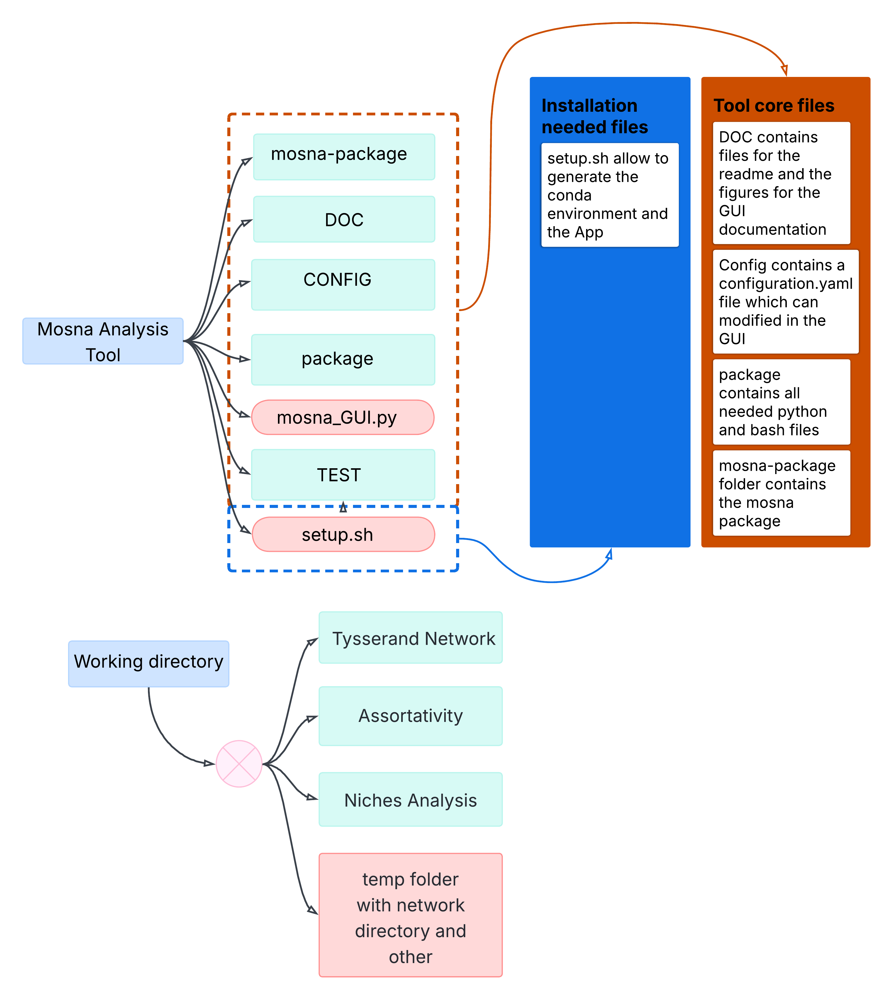
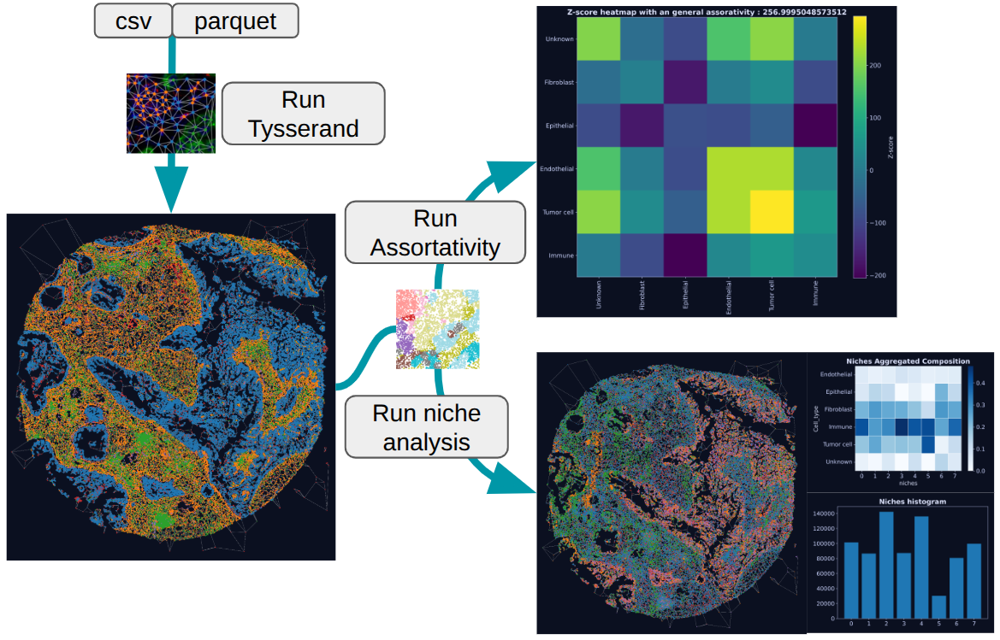

# Mosna_analysis

- [Installation](#installation)
- [Tool](#tool)
    - [Tool Architecture](#tool-architecture)
    - [GUI Workflow](#tool-workflow)
    - [Step 2](#step-1-draw-tysserand-spatial-networks)
    - [Step 3](#step-2-generate-assortativity)
    - [Step 4](#step-3-plot-niches-analysis)

# Installation

clone my repo and run this:

    chmod +x setup.sh
    ./setup.sh

# Tool

The purpose of this tool is to facilitate the using of MOSNA and Tysserand, two package made by PancaldiLAB to build spatial networks and to analyse them with statistics.
This tool provide a GUI to generate easily the networks and other spatial analyse.

but you can also use it directly in terminal by using those command:

    conda activate mosna-GUI

    python -m package.tysserand_network --file CONFIG/configuration.yaml --working_dir ~/Desktop/
    python -m package.assortativity --file CONFIG/configuration.yaml --working_dir ~/Desktop/
    python -m package.niche_analysis --file CONFIG/configuration.yaml --working_dir ~/Desktop/

## Tool architecture 

## Tool Workflow

### ❗You can directly use Tysserand tool of my own tool instead of run pre-processing if you respect this the following format of your data:

❗ You must respect few things: 

- file could be Pandas DataFrame so table with .csv or .parquet extension

Tab for the following file format:
- .csv or .parquet

| Index  | CellID  | patient | Sample | X_position | Y_position | Phenotypes |
|--------|---------|---------|--------|------------|------------|------------|
| Cell 1 |    ...     |    ...     |     ...   |     ...       |   ...         |    ...        |
|  ...   |    ...     |      ...   |     ...   |     ...       |   ...         |     ...       |
| Cell N |    ...     |     ...    |    ...    |    ...        |     ...       |    ...        |

## Step 1: Draw Tysserand Spatial Networks

This step generate Tysserand networks for each patient/sample. You must fill **Tysserand** section.

| Parameter                      | Description       |
|--------------------------|-------------------|
| **Nodes directory**          | folder where you store all your spatial data |
| **Patient column name**      | Name of the first level of division for your file for example: 'patient' |
| **Sample column name**       | Name of the second level of division if it exists |
| **Extension**                | Extension of all files |
| **X coordinates column**     | Name of the column containing the X spatial coordinates |
| **Y coordinates column**     | Name of the column containing the Y spatial coordinates |
| **Phenotype column**         | Column defining the phenotype of each cell |
| **Edges method**             | Method used to compute edges | 
| **Min neighbors**            | Minimum number of neighbors for the KNN edges |
| **CPU**                      | Number of CPUs used for the parallelization process |

## Step 2: Generate Assortativity

For this step you must fill **Assortativity** section. This step allow you to generate assortativity for each patient/sample networks and for an aggregate data.

| Parameter                   | Description       |
|-----------------------|-------------------|
| **Network directory**    | Folder where you store all your edges and nodes. Default if you run it after Tysserand Run |
| **Phenotype column**      | Name of the first level of division for your file for example: 'patient' |
| **Patient column name**   | Name of the second level of division if it exists |
| **Sample column name**    | Extension of all files |
| **Extension**             | Column defining the phenotype of each cell |
| **Index**                 | Name of the column for the cells reference |

## Step 3: Plot Niches Analysis

In this step you must fill **NAS** section. This step will generate for you niches composition and all networks recolored by niche for each patient/sample and also the niche composition for aggregated nodes for all images of one type. 

| Parameter                   | Description       |
|-----------------------|-------------------|
| **Network directory**     | Folder where you store all your edges and nodes. Default if you run it after Tysserand Run |
| **Saving directory**       | Name of the saving folder to multiply the analysis | 
| **Patient column name** | Name of the first level of division for your file for example: 'patient' |
| **Sample column name**  | Name of the second level of division if it exists |
| **Phenotype column** | Column defining the phenotype of each cell |
| **Processing method** | Choose the method of processing (per sample (work in progress) or aggregation) |
| **Niches method** | Choose the method of niche analysis (NAS, SCAN-IT (work in progress)) |
| **X coordinates column for niches**    | X column if it exist to rebuild all networks with niches clustering |
| **Y coordinates column for niches**    | Y column if it exist to rebuild all networks with niches clustering |

**Niche clustering parameters:**

| Parameter               | Description       |
|-------------------|-------------------|
| **order** | Neighborhood order used in **NAS** aggregation. `order=1` uses direct neighbors only, while higher values include more distant neighbors in the graph |
| **stat_funcs** | Statistical functions applied to aggregated neighbor features in **NAS**, such as `mean`, `std`, `max`, or `median` |
| **stat_names** | Names associated with `stat_funcs`, used to label the generated feature columns |
| **clusterer_type** | Clustering method used to define niches or groups, for example `gmm`, `spectral`, `hdbscan`, or `leiden` |
| **metric** | Distance metric used to compare observations, for example `euclidean`, `manhattan`, or `cosine` |
| **normalize** | Normalization method applied to niche composition features before the predictive model, for example `total`, `obs`, `niche`, or `clr` |
| **reducer_type** | Dimensionality reduction method applied before clustering, such as `umap` |

### Reducer Parameters

| Parameter               | Description       |
|----------|---------|
| **n_neighbors** (for UMAP) | Number of neighbors used to build the local structure of the data, especially in UMAP or graph construction |
| **min_dist** (for UMAP) | UMAP parameter controlling how close points can be in the reduced space. Smaller values usually produce tighter groups |
| **dim_clust** (for UMAP) | Number of dimensions kept in the reduced space for clustering |

### Clusterer Parameters

| Parameter               | Description       |
|----------|---------|
| **k_cluster** | Number of neighbors used during the clustering step when building or refining the graph structure |
| **n_clusters** (for gmm and spectral) | Number of clusters to produce for methods that require it, mainly `gmm` and `spectral` |
| **resolution** (for Leiden) | Granularity parameter specific to **Leiden** clustering. Lower values usually give fewer clusters, higher values give more |
| **min_cluster_size** (for HDBSCAN) | Minimum cluster size for **HDBSCAN**. Smaller values allow rare clusters, larger values make clustering more conservative |

