# Mosna_analysis

- [Installation](#installation)
- [Tool](#tool)
    - [Tool Architecture](#tool-architecture)
    - [GUI](#graphic-interface-to-control-your-using)
    - [Step 1](#step-1-pre-processing)
    - [Step 2](#step-2-draw-tysserand-spatial-networks)
    - [Step 3](#step-3-generate-assortativity)
    - [Step 4](#step-4-plot-niches-analysis)
    - [Step 5](#step-5-synthetic-spatial-network-generation-using-mrf-and-assortativity)
    - [Step 6](#step-6-remove-all-temporary-file-in-output_data-file)
- [Exemple of Using](#exemple-of-using)
    - [Tysserand Network](#tysserand-network)
    - [Assortativity](#assortativity)
    - [Niches Composition](#niches-composition)
    - [Network Generation](#synthetic-network-generation)

# Installation

clone my repo and run this:

    chmod +x setup.sh
    ./setup.sh

# Tool

The purpose of this tool is to facilitate the using of MOSNA and Tysserand, two package made by PancaldiLAB to build spatial networks and to analyse them with statistics.
This tool provide a GUI to generate easily the networks and other spatial analyse.

  conda activate mosna
  python mosna_GUI.py

## Tool architecture 

### You must follow this architecture provided to make it works:

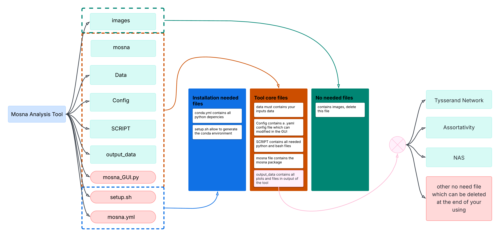

### This image explain how works the tool:

Image qui explique le fonctionnement

## Graphic Interfaces to control your using

**2 GUI :**
- 1 for pre-processing
- 1 for Tysserand and MOSNA analysis

before to be able to obtain your tysserand network you must complete first all parameters for the different, this parameters will be explained right after:

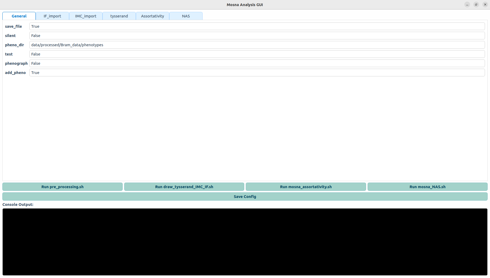

## Step 1: Pre-processing (No NEEDED)

The pre-processing step is required to generate temp file needed for the following steps. 4 files will be created by type of data (IF's panel and IMC)

- cell_pos_pheno = Phenotypes and position are present in this file for each cell sort by sample and patient
- cell_pos = the same thing but without phenotypes
- sample_cell = patient and sample for each cell
- markers = all biomarkers for each cell sort by sample and patient

You must fill **General**, **IF_import** and **IMC_import** sections.

| Section     | Clé                   | Descripton        |
|-------------|-----------------------|-------------------|
|**General**  | silent                |                   |
|             | pheno_dir             |                   |
|             | phenograph            |                   |
|             | add_pheno             |                   |
|**IF_import**| present_in            |                   |
|             | directory_path        |                   |
|             | panel                 |                   |
|             | path_encoding_patient |                   |
|             | path_file_to_patient  |                   |
|             | columns_to_drop       |                   |
|             | layer_columns         |                   |
|             | patient_columns       |                   |
|             | marker_columns        |                   |
|             | cell_id_columns       |                   |
|             | spatial_columns       |                   |
|             | normalize_data        |                   |
|             | re_index              |                   |
|             | there_is_duplicata    |                   |
|**IMC_import**| present_in           |                   |
|             | directory_path        |                   |
|             | path_encoding_patient |                   |
|             | path_file_to_patient  |                   |
|             | columns_to_drop       |                   |
|             | layer_columns         |                   |
|             | patient_columns       |                   |
|             | marker_columns        |                   |
|             | cell_id_columns       |                   |
|             | spatial_columns       |                   |
|             | normalize_data        |                   |
|             | re_index              |                   |
|             | there_is_duplicata    |                   |

### ❗You can directly use Tysserand tool of my own tool instead of run pre-processing if you respect this the following format of your data:

❗ You must respect few things: 

- file are Pandas DataFrame convert into parquet with df.to_parquet()
- here type could be IF_panel or IMC, panel need to have the same name than in your data file
- 'Sample' in the following tab must replace by 'ROI' for IMC or 'layer' for IF images
- This files must be put in 'output_data' folder

❗ All this file contains all your data, if you have 30 IMC images from a same dataset you can concatenate in this files

Tab for the following file format:
- type_panel.parquet or type.parquet

| Index  | CellID  | patient | Sample | X_position | Y_position | Phenotypes |
|--------|---------|---------|--------|------------|------------|------------|
| Cell 1 |    ...     |    ...     |     ...   |     ...       |   ...         |    ...        |
|  ...   |    ...     |      ...   |     ...   |     ...       |   ...         |     ...       |
| Cell N |    ...     |     ...    |    ...    |    ...        |     ...       |    ...        |

- Or without Phenotyping but you will need markers to Phenotype by using Phenograph (included in the tool)

| Index  | CellID  | patient | Sample | X_position | Y_position |
|--------|---------|---------|--------|------------|------------|
| Cell 1 |    ...     |  ...       |     ...   |   ...         |    ...        |
|  ...   |      ...   |      ...   |    ...    |      ...      |    ...        |
| Cell N |    ...     |     ...    |      ...  |      ...      |    ...        |

- type_markers.parquet (only needed if you don't have Phenotypes column)
replace the name of bio-marker 1 to n by the real name of yours bio-makers

| Index  | CellID  | Maker 1 | ... | Marker N   |
|--------|---------|---------|--------|------------|
| Cell 1 |    ...     |   ...      |  ...      |    ...       |
|  ...   |     ...    |     ...    |    ...    |      ...      |
| Cell N |     ...    |     ...    |   ...     |      ...      |

## Step 2: Draw Tysserand Spatial Networks

This step generate Tysserand networks for each patient/sample. You must fill **Tysserand** section.

| Clé                      | Description       |
|--------------------------|-------------------|
| IF_perform               |                   |
| panel                    |                   |
| IMC_perform              |                   |
| cpu                      |                   |
| k_neighbors_phenograph   |                   |
| primary_metric_phenograph|                   |
| method_tysserand         |                   |
| min_neighbors            |                   | 

## Step 3: Generate Assortativity

For this step you must fill **Assortativity** section. This step allow you to generate assortativity for each patient/sample networks and for an aggregate data of one type of data (all IF for one panel for exemple)

| Clé                   | Description       |
|-----------------------|-------------------|
|IF_perform             |                   |
|panel                  |                   |
|IMC_perform            |                   |
|perform_batch          |                   |
|perform_clr_transfo    |                   |

## Step 4: Plot Niches Analysis

In this step you must fill **NAS** section. This step will generate for you niches composition and all networks recolored by niche for each patient/sample and also the niche composition for aggregated nodes for all images of one type. 

| Clé                   | Description       |
|-----------------------|-------------------|
|method                 |                   |
|output_name_file       |                   |
|IMC_perform            |                   |
|IF_perform             |                   |
|panel                  |                   |
|node_aggregation       |                   | 
|perform_NAS_all_sample |                   |

And for each niche clustering and plotting (IF and IMC nodes aggregation, IF and IMC for each patient/sample):

**Niche clustering parameters:**

| Clé               | Description       |
|-------------------|-------------------|
| order             |                   |
| stat_funcs        |                   |
| stat_names        |                   |
| clusterer_type    |                   |
| n_clusters        |                   |
| reducer_type      |                   |
| metric            |                   |
| resolution        |                   |
| n_neighbors       |                   |
| min_dist          |                   |
| dim_clust         |                   |
| min_cluster_size  |                   |
| k_cluster         |                   |
| normalize         |                   |

## Step 5: Synthetic Spatial Network Generation using MRF and Assortativity

This repository implements a pipeline to generate **synthetic spatial tissue-like networks** representing cell phenotypes, using **assortativity constraints** and a **Markov Random Field (MRF)** model.

### Overview

The pipeline creates a 2D tissue-like structure with cells (nodes), connected by spatial proximity (edges), and assigns phenotypes to each cell such that:

- **Phenotype-Phenotype assortativity** (given as Z-scores) is respected
- **Global phenotype proportions** are enforced with a tunable tolerance
- The final output includes:
  - A list of nodes with spatial coordinates and phenotypes
  - A list of spatial edges derived from Delaunay triangulation

## Step 6: Remove all temporary file in output_data file

Clear all temp file to keep only analysed data

# Exemple of using

In this part we will provide an example of this tool step by step

### Tysserand Network 

In this all part, different spatial networks plots are present

#### IMC tysserand network

#### IF first panel 1 and 2 tysserand network
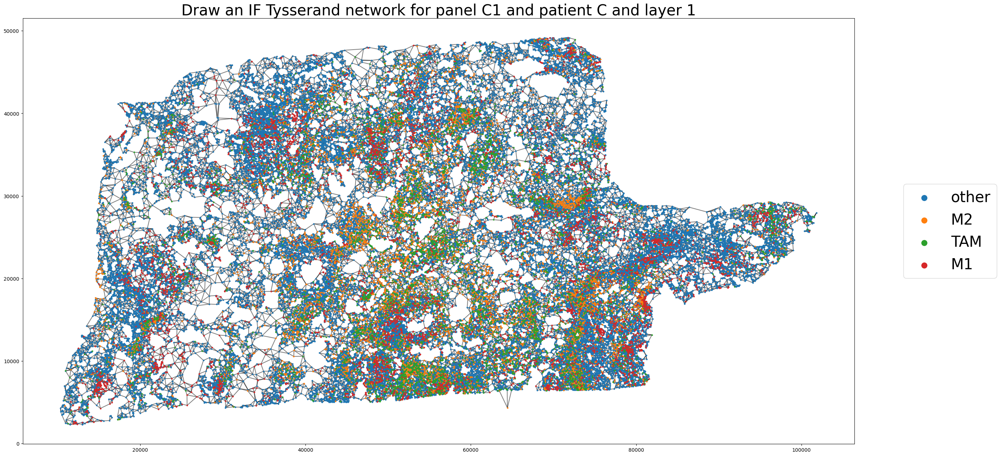 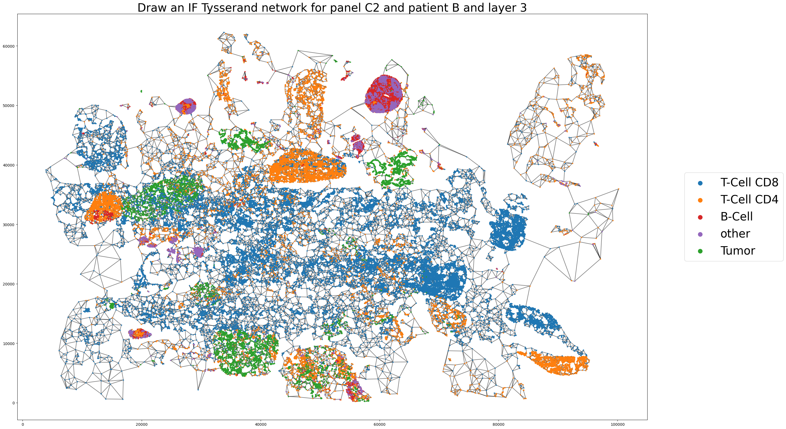

### Assortativity

In this part, all different assortativity plots are present

#### IF and IMC assortativity for one patient/sample
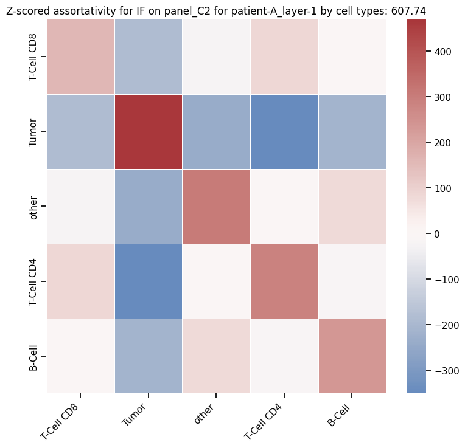 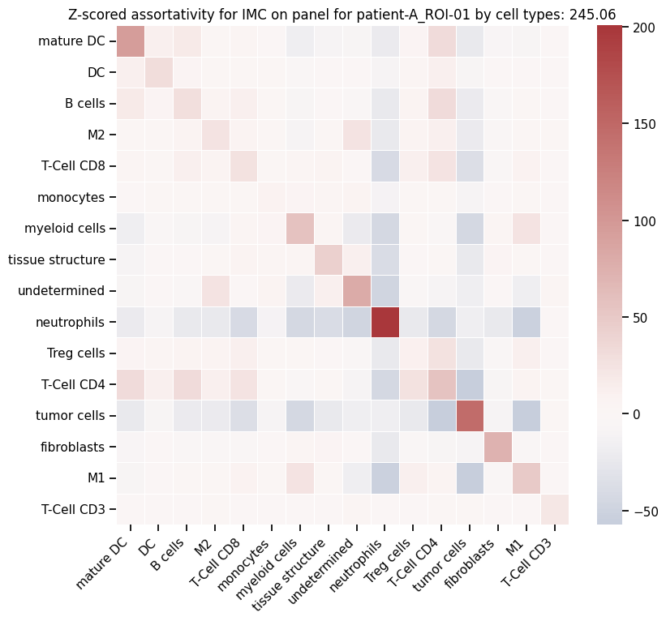

#### IF and IMC assortativity aggregated by mean
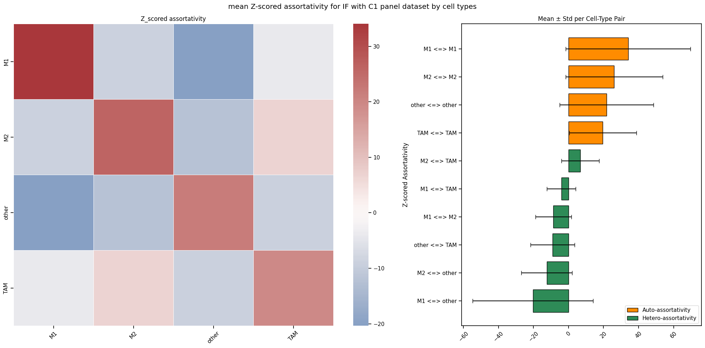 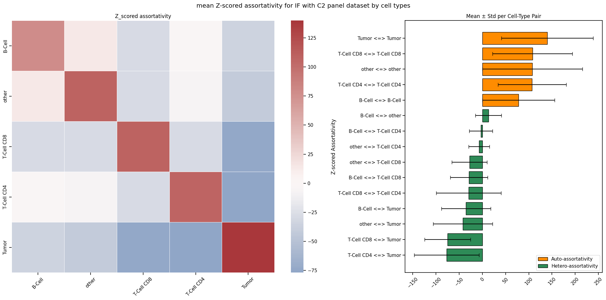

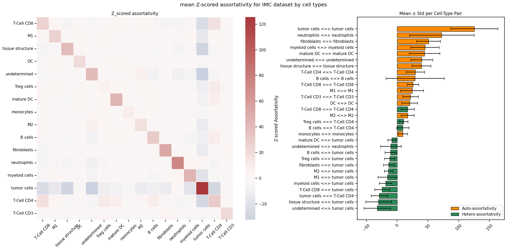
In this image only the most important z-score (absolute values) are present to keep this plot visible

Here the real barplot with all tuples of phenotypes.
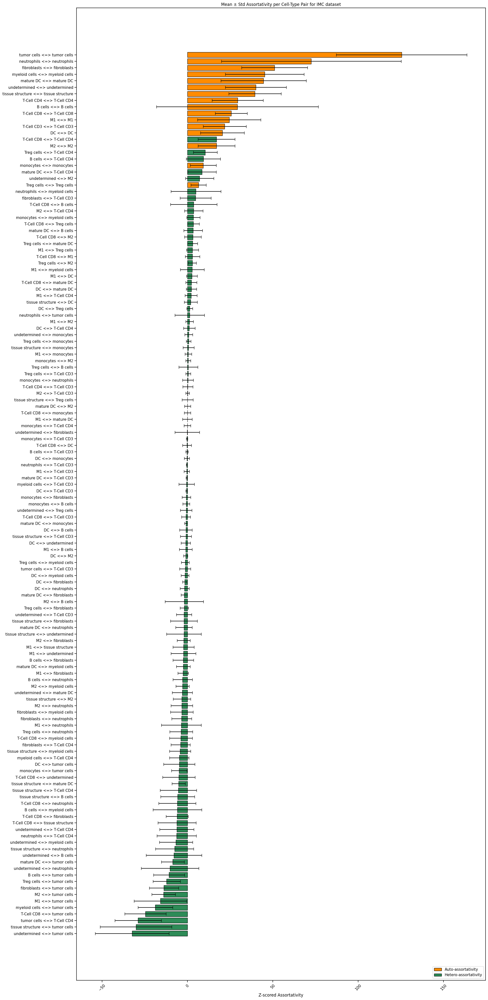

### Niches composition

In this part, all different niche analysis plots are present

#### IF and IMC aggregated nodes
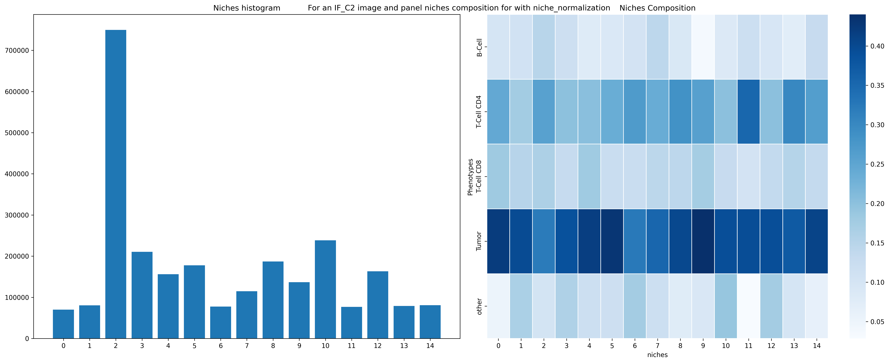 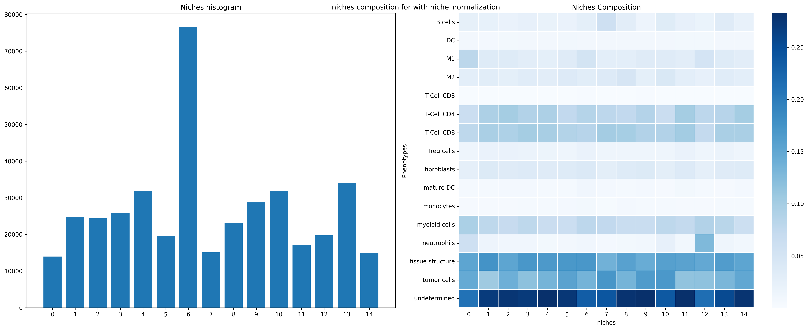

#### IF and IMC for one patient/sample
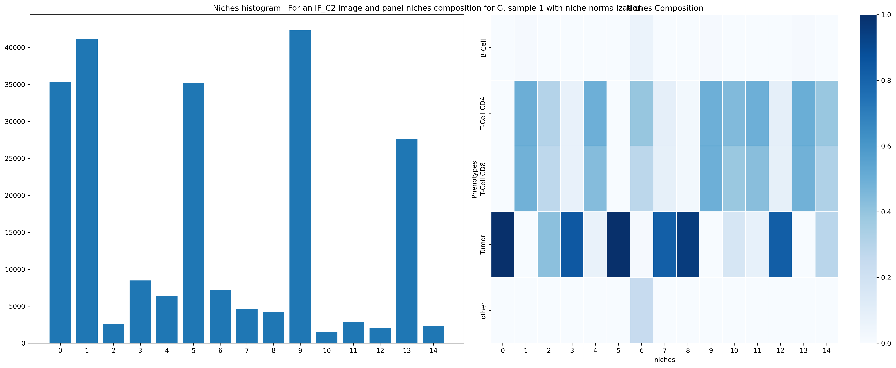 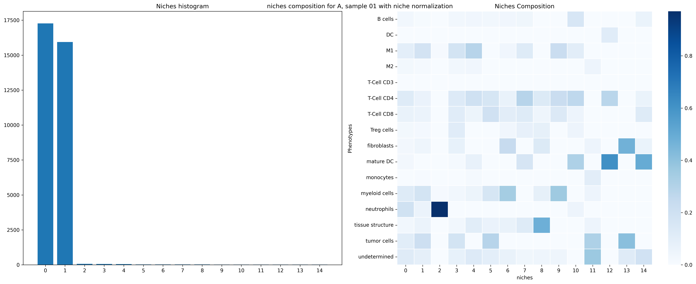

and the associated network colored by niche:

 

