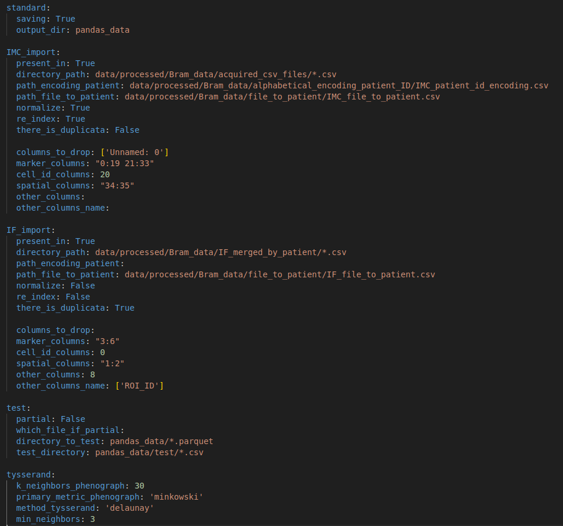
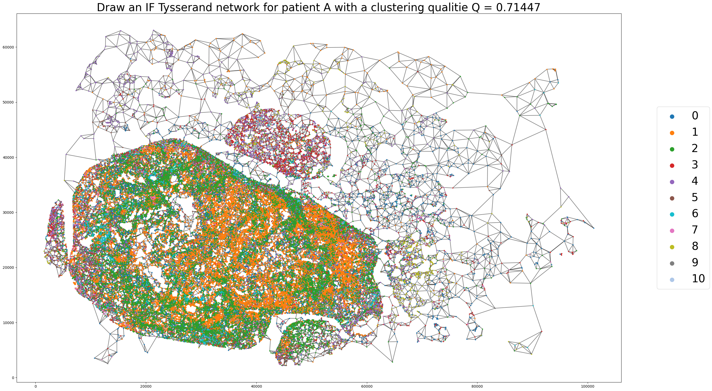
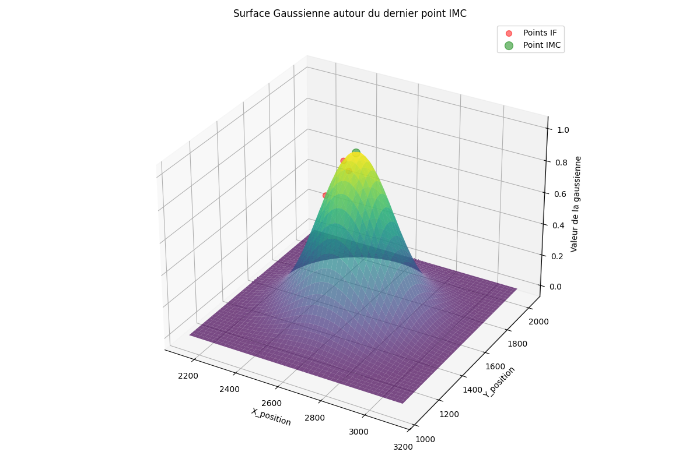

# Mosna_analysis

- [Installation](#installation)
- [Tool](#tool)

Using mosna to analyse IMC picture with niches analysis         ( WORK IN PROGRESS )

## Installation

First clone this repo :

    git clone https://github.com/AlexCoul/mosna.git

### To install only mosna lib and ohter dependancies you can make the following steps :

To use mosna with GPU-compatible libraries, you can try:

    conda create --solver=libmamba -n mosna-gpu -c rapidsai -c conda-forge -c nvidia -c pytorch rapids=23.04.01 python=3.10 cuda-version=11.2 pytorch==1.12.1 torchvision==0.13.1 torchaudio==0.12.1 scanpy
    conda activate mosna-gpu

without GPU you can do:

    conda create --solver=libmamba -n mosna -c conda-forge python=3.10 scanpy
    conda activate mosna

then do:

    pip install ipykernel ipywidgets napari
    pip install tysserand

then cd /path/to/mosna_benchmark/

    pip install -e .
    pip install scipy==1.13

### To install directly my env you can make the following steps :

clone my repo and run this scrip : 

    cd Mosna_analysis
    conda env create -f mosna.yml -n mosna
    conda activate mosna
    cd mosna
    pip install -e .
    pip install scipy==1.13

## Tool

Mosna use tysserand to build networks to analyse them after. This image is a tysserand network of IMC data from one patient and one sample where each nodes are cells, colored by cluster and the clustering was found by using phenograp on 34 markers.

### Tysserand Network

before to be able to obtain your tysserand network you must complete the associated config file in CONFIG/tysserand.yaml:

to have all tysserand networks of your IMC and IF csv files you must run this command:

    chmod u+x draw_tysserand.sh
    ./draw_tysserand.sh

### Cell encounter

before to be able to obtain a cell to cell correspondance between IF and IMC you must ensure that coordinates are the same for IF and IMC and also you must complete the associated config file in CONFIG/cell_encounter.yaml.

to have your cell to cell encounter between your IMC and IF csv files you must run this command:

    chmod u+x cell_encounter.sh
    ./cell_encounter.sh

